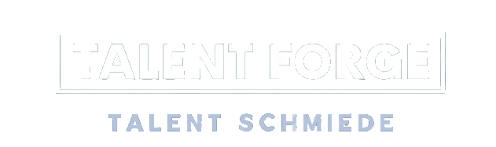
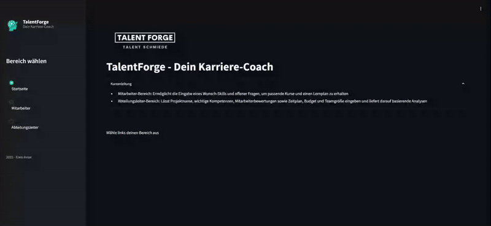
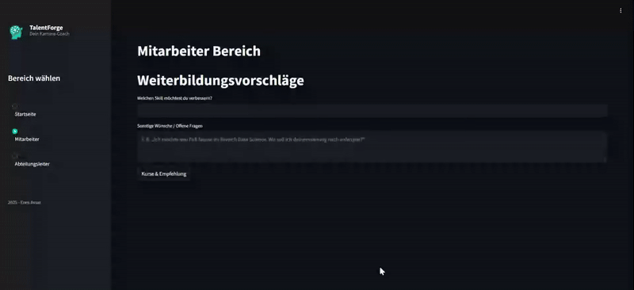

# TalentForge 

Version: 0.0.2

Die App bietet auf einer einzigen Seite zwei Bereiche:

einen für Mitarbeitende und einen für Abteilungsleiter. Jede Rolle wählt in der Sidebar ihren Bereich und erhält bdef. Funktionen:


## Datenquelle Kurse

Für dieses mvp wurden Kurse einmalig per n8n-scraper extrahiert und in `assets/courses.json` abgelegt.  
Bei einem produktiven Deployment würde an dieser Stelle ein kontinuierlich laufender Web-Scraper stehen, der fortlaufend die neuesten und relevantesten Kurse aus dem Netz (übliche kurs-Websites) sammelt und automatisch aktualisiert.

1. **Mitarbeiter-Bereich – Weiterbildungsvorschläge** 


   - Skill per Textfeld auswählen  
   - Freies Textfeld „Sonstige Wünsche“ für pers. Ziele  
   - Button „Kurse & Empfehlung“ lädt Kurse aus `courses.json` und zeigt sie an  
   - Spinner signalisiert laufende llm-analyse  
   - roadmap artige Schritt-für-Schritt-Pläne via gpt4

2. **Abteilungsleiter-Bereich – Projekt & Skill-Analyse**  


   1. Projektdefinition – Name & Beschreibung eingeben  
   2. Kompetenzentwicklung – Projektskills aus Dropdown wählen, Rahmenbedingungen notieren  
   3. Mitarbeitende bewerte – Anzahl festlegen, Namen eingeben, Skill-Slider bewerten und per Button „Kurs- & Skill-Empfehlung generieren“ Kurse & LLM-Empfehlung abrufen  
   4. Projektanalyse und Ressourcenskalierung – Start/Ende, Budget, Teamgröße angeben und per Button „Projekt bewerten“ eine LLM-gestützte Gesamtanalyse abrufen  

Alle LLM-Aufrufe (Skill-Gap, Projektanalyse, individuelle Lernpläne) laufen über `llm_utils.py`, das doe open ai (gpt  -4) kapselt. 

Die Kursdaten liegen lokal in `assets/courses.json`.

---

## Installation


1. Virtuelle Umgebung anlegen & aktivieren  
   ```bash
   python -m venv .venv

   .venv\Scripts\activate      
   ```

2. Abhängigkeiten installieren  
   ```bash
   pip install -r requirements.txt
   ```

3. Umgebungsvariable für OpenAI anlegen  
   Erstelle eine Datei `.env` mit folgendem Inhalt:  
   ```
   OPENAI_API_KEY=sk-...
   ```

---

## Starten

```bash
streamlit run main.py
```


---


## Tests

end2end mit pytest + playwright:  
```bash
pytest tests/test_app_e2e.py --headed
```

---


## Datenquelle Kurse

Für dieses MVP wurden die Kurse einmalig per n8n-Webscraper extrahiert und in `assets/courses.json` abgelegt.  
Bei einem produktiven Deployment würde an dieser Stelle ein kontinuierlich laufender Web-Scraper stehen, der fortlaufend die neuesten und relevantesten Kurse aus dem Netz (übliche kurs-Websites) sammelt und automatisch aktualisiert.

